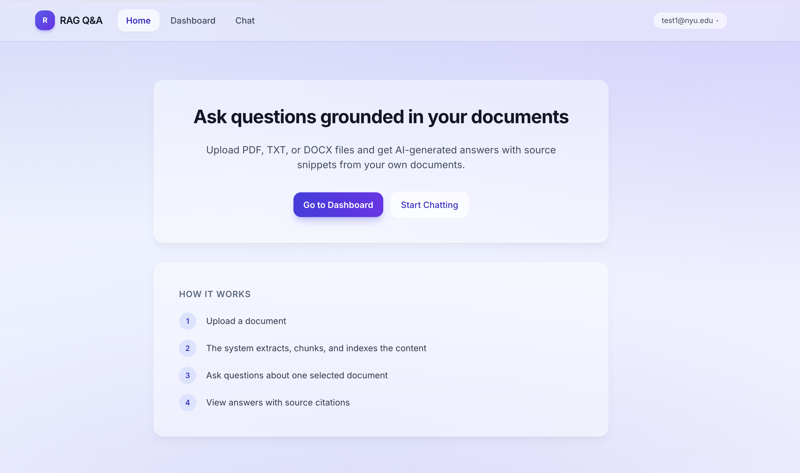
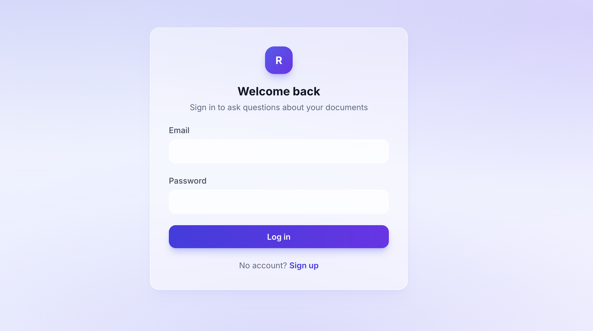
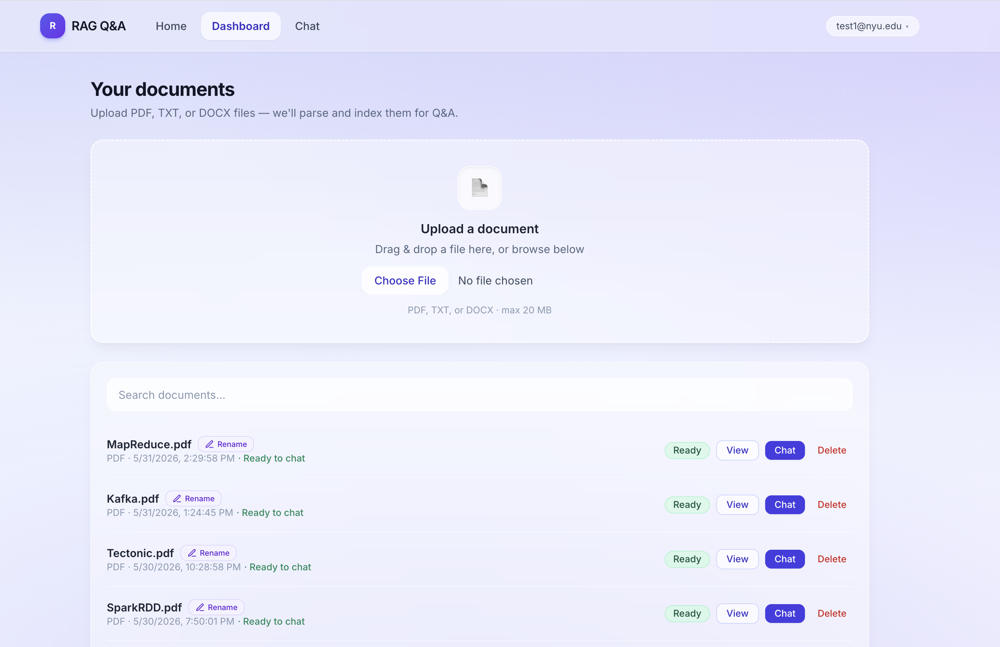
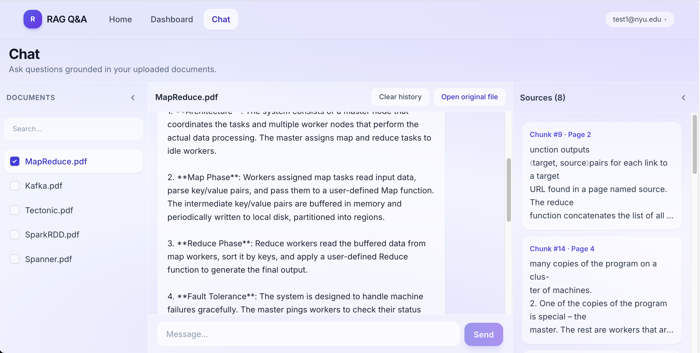

# RAG Document Q&A App

This is my RAG homework project. Users upload PDF/TXT/DOCX, pick one file, ask questions, and get answers with source snippets from that document.

It runs locally with Docker Compose. It is an MVP, not a production app — but I kept frontend, API, and backend in separate folders so the architecture is easy to walk through.

## Screenshots

**Home** — landing page and how the app works.



**Log in** — JWT auth before upload and chat.



**Dashboard** — upload PDF/TXT/DOCX, track ingestion status, open or chat with a ready document.



**Chat** — three-column layout: document picker, chat area, and a sources panel showing retrieved chunks.



## Features

- Sign up and log in with JWT
- Upload PDF, TXT, and DOCX files (extension whitelist, size limit, basic content checks, filename sanitization — not malware scanning)
- Background ingestion with status tracking (`uploaded` → `processing` → `ready` / `failed`)
- Text chunking, embeddings, and **hybrid RAG retrieval** (rule-based query router + pgvector search)
- Grounded answers with source snippets; synthesis across retrieved chunks when helpful
- **Retrieval mode label** under each assistant answer (shows hybrid router path, e.g. Semantic search, Summary)
- Clear chat history (messages + Redis answer cache for that document)
- Single-document chat with source snippets
- Streaming chat answers over SSE (one active stream per browser session — input and document switching lock while the assistant is answering)
- Optional Redis answer cache for repeat questions (app still works if Redis is down)
- Optional Redis chat rate limit on ask routes (10/min per user; also fail-open)
- Owner-only document access — users cannot read each other's files
- Rename documents, search the list, open original uploads, deep link chat with `?doc=`

## Tech Stack

| Area | Technology |
| ---- | ---------- |
| Frontend | React, Vite, TypeScript, Tailwind CSS |
| API layer | FastAPI, Pydantic, JWT |
| Backend / core | Python services, repositories, RAG pipeline (`app` package) |
| Database | PostgreSQL 16 + pgvector |
| Cache | Redis (optional answer cache + chat rate limit) |
| Migrations | Alembic |
| Storage | Local disk for MVP; S3-style backend planned |
| LLM / embeddings | OpenAI-compatible chat (default **`gpt-5-mini`** via `LLM_MODEL`); local MiniLM or OpenAI embeddings via env config |

## Architecture Overview

The repo has three logical layers. In the MVP they run in one Python process, but the folder boundaries are intentional:

1. **Frontend** (`frontend/`) — React UI only. Calls the API over HTTP/SSE.
2. **API layer** (`middleware/`) — FastAPI routes, JWT auth, request validation, HTTP errors.
3. **Backend / core** (`backend/`, import name `app`) — models, repositories, services, RAG pipeline, storage, cache. Installed with `pip install -e ./backend` and imported by FastAPI in the same process.

This keeps local setup simple while still showing clear boundaries for interviews and future scaling.

**Docs for submission:**

| Artifact | Link |
| -------- | ---- |
| System design (includes scalability) | [docs/system_design.md](docs/system_design.md) |
| RAG pipeline (retrieval, prompts, debugging) | [docs/rag_pipeline.md](docs/rag_pipeline.md) |
| Achieved vs future work | [docs/engineering-notes/achieved-and-future-work.md](docs/engineering-notes/achieved-and-future-work.md) |
| Known limitations | [docs/engineering-notes/known-limitations.md](docs/engineering-notes/known-limitations.md) |
| GitHub repo | [April-48/RAG-Application](https://github.com/April-48/RAG-Application) |

**More docs:**

- [System Design](docs/system_design.md)
- [API Design](docs/api_design.md)
- [Architecture Decision Records](docs/adr/)

## Quick Start

**Full guide:** [Setup Guide](docs/setup.md)

### Option A — Docker Compose (full stack)

```bash
chmod +x scripts/docker_setup.sh scripts/docker_start.sh
./scripts/docker_setup.sh          # first time: build, start, migrate
./scripts/docker_start.sh          # later restarts
./scripts/docker_start.sh --build  # after backend/RAG code changes (Docker mode)
```

Or manually:

```bash
cp .env.example .env          # set OPENAI_API_KEY for chat
docker compose up --build
docker compose run --rm middleware bash -lc "cd /app/backend && alembic upgrade head"
```

Open [http://localhost:5173](http://localhost:5173) · API docs [http://localhost:8000/docs](http://localhost:8000/docs)

### Option B — Host dev (API on laptop, db/redis in Docker)

```bash
chmod +x scripts/dev_setup.sh scripts/dev_start.sh
./scripts/dev_setup.sh          # env, docker db+redis, deps, migrations
./scripts/dev_start.sh          # API on :8000
cd frontend && npm run dev      # second terminal → :5173
```

For Option B, use **localhost** in `DATABASE_URL` and `REDIS_URL` inside `.env`.

Set `OPENAI_API_KEY` (or `LLM_BASE_URL`) before testing chat.

**Health check:** `GET http://localhost:8000/health` → `{"status":"ok"}`

## Model Choice

The default chat model is set with `LLM_MODEL` in `.env`.

I use `gpt-5-mini` as the default. It is OpenAI's compact GPT-5 model —
better instruction following and reasoning than the GPT-4.1 generation,
without the cost of a full-size model. For a RAG app where the prompt
already contains the retrieved context, a strong instruction-following
model matters more than raw size.

The model is kept configurable so you can swap it without touching the code.

```env
LLM_MODEL=gpt-5-mini        # default — good balance of quality and cost
# Do not set LLM_TEMPERATURE=0 for gpt-5-mini (provider default only)

# Higher capability:
# LLM_MODEL=gpt-5.4-mini    # faster, stronger reasoning, higher cost

# Lower cost:
# LLM_MODEL=gpt-4.1-mini
# LLM_MODEL=gpt-4o-mini     # older fallback, widely supported
```

This project is focused on the RAG pipeline — ingestion, chunking, hybrid
retrieval, source grounding, and streaming — not on squeezing the most out
of the LLM. So the model stays swappable rather than hard-coded.

## Demo Flow

**Checklist:** [Demo Checklist](docs/engineering-notes/demo-checklist.md)

1. Sign up or log in.
2. Upload a **text-based** PDF, TXT, or DOCX (scanned PDFs need OCR — not built yet).
3. Wait until status is `ready`.
4. Open Chat and select the document.
5. Ask a content question the document can answer (e.g. main idea, key points, limitations). Show streaming response, sources, and the **Retrieved via** label under the answer. While the answer streams, the input is disabled and the sidebar shows “AI is answering. Please wait…”
6. With Redis running, ask the **same question twice** to show cache hit (see checklist).
7. Optional: **Clear chat history** and confirm messages disappear.
8. Optional: sign up as a second user and confirm that the first user's document returns **404** — not 403, not the document.
9. Optional: try uploading a renamed `.exe` as `.pdf` — should be rejected before ingestion (see [troubleshooting](docs/engineering-notes/troubleshooting.md)).

## Engineering Docs

| Document | Purpose |
| -------- | ------- |
| [System Design](docs/system_design.md) | Architecture, scalability, RAG flows |
| [RAG Pipeline](docs/rag_pipeline.md) | Ingest, retrieval, prompts, debugging |
| [Achieved vs Future Work](docs/engineering-notes/achieved-and-future-work.md) | What works today vs what is left |
| [API Design](docs/api_design.md) | HTTP API surface |
| [Setup Guide](docs/setup.md) | Prerequisites, env vars, commands |
| [Demo Checklist](docs/engineering-notes/demo-checklist.md) | Pre-demo self-check |
| [Known Limitations](docs/engineering-notes/known-limitations.md) | MVP boundaries |
| [Troubleshooting](docs/engineering-notes/troubleshooting.md) | Common local fixes |
| [ADRs](docs/adr/) | Why I chose this stack and scope |

**Key ADRs:**

- [0001 — Three-layer architecture](docs/adr/0001-three-layer-architecture.md)
- [0002 — PostgreSQL + pgvector](docs/adr/0002-postgres-pgvector.md)
- [0003 — Single-document RAG scope](docs/adr/0003-single-document-rag-scope.md)
- [0004 — Background ingestion](docs/adr/0004-async-ingestion-backgroundtasks.md)
- [0005 — Redis cache + chat rate limit](docs/adr/0005-redis-answer-cache.md)
- [0006 — Alembic migrations](docs/adr/0006-alembic-migrations.md)
- [0007 — Local storage vs S3](docs/adr/0007-local-storage-vs-s3.md)

Layer notes: [frontend](frontend/README.md) · [API layer](middleware/README.md) · [backend](backend/README.md)

## Testing

**Backend** — **80 pytest tests** (auth, document ownership, upload validation, hybrid retrieval/query router, Redis cache keys, clear-history routes, mocked chat, retrieval mode storage):

```bash
cd backend
pip install -e .
pytest
```

**Frontend** — TypeScript check + production build (no Playwright/Cypress):

```bash
cd frontend
npm run build
```

Tests do not call real LLM or embedding APIs — everything external is mocked. The full upload → chat → sources flow is checked manually with the [demo checklist](docs/engineering-notes/demo-checklist.md).

## Known Limitations

This is an MVP, not a production RAG platform.

- One selected document per chat session
- One active streaming answer per browser session (no concurrent multi-chat streaming yet)
- Ingestion uses FastAPI `BackgroundTasks`, not a real job queue
- Local disk storage does not work well with multiple API servers
- Scanned/image-only PDFs need OCR (not implemented)
- Answer cache expires by TTL; not invalidated when chunks change — **Clear chat history** clears cache for that document, or re-upload after ingest changes
- Switching embedding dimensions (e.g. local 384 → OpenAI 1536) requires a new migration and full re-ingest
- Redis chat rate limiting is optional and fail-open; not real abuse prevention

**Full list:** [Known Limitations](docs/engineering-notes/known-limitations.md)

## Future improvements

How I would scale this (workers, object storage, load-balanced API, vector search, and a cloud path via Supabase/S3/managed Redis) is in [System Design](docs/system_design.md#future-scalability-focus).
